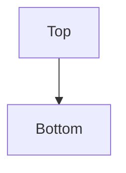

👋 Hi, I’m @deiussum

I've been developing software since the late 90s.  My Github space is mostly a bunch of private repos for side projects I've done over the years.  I've got a couple I made public and will likely open up more of them at some point when I get the time to look back at them to see if they even still work. :)  Nothing too exciting here.

Testing to see if GitHub displays Mermaid diagrams.

<!---
deiussum/deiussum is a ✨ special ✨ repository because its `README.md` (this file) appears on your GitHub profile.
You can click the Preview link to take a look at your changes.
--->
